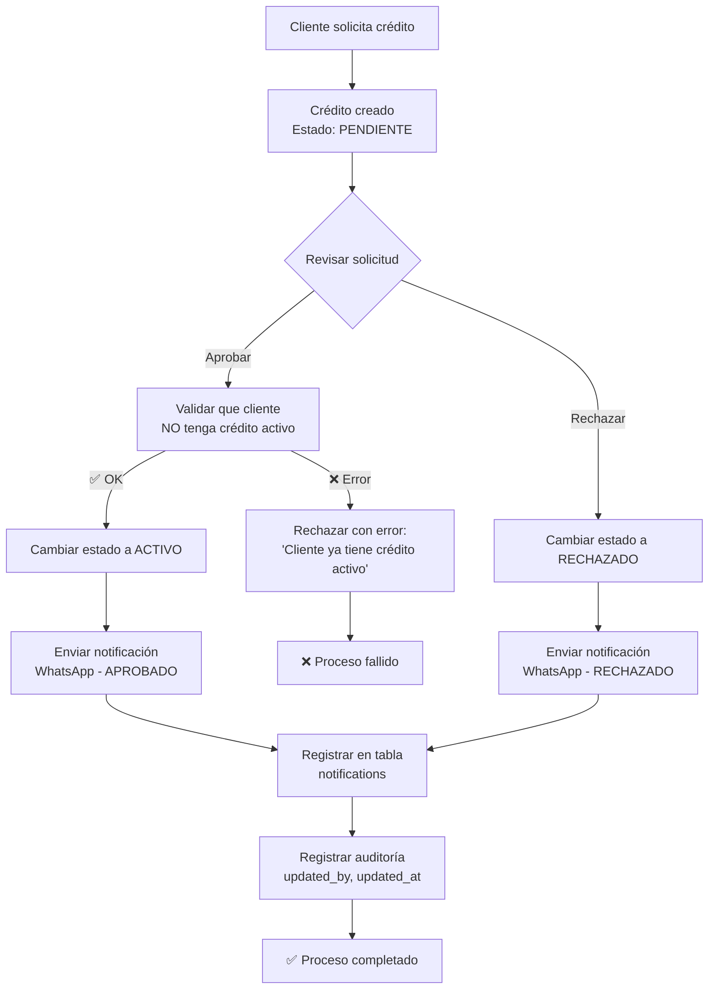
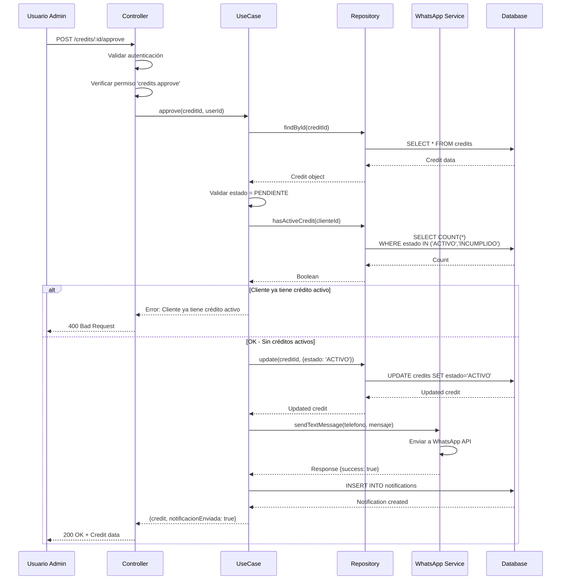
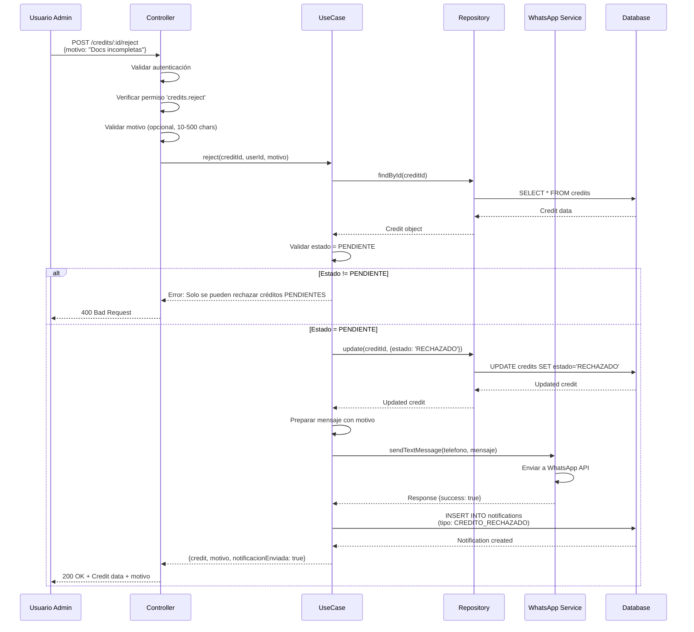
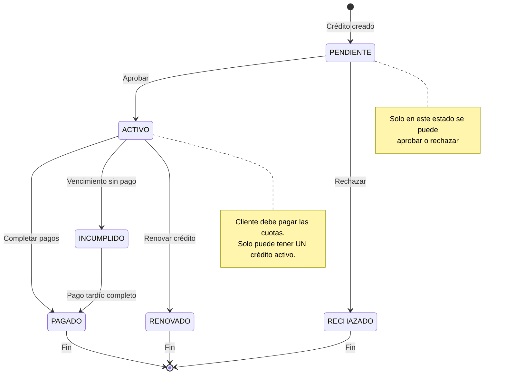
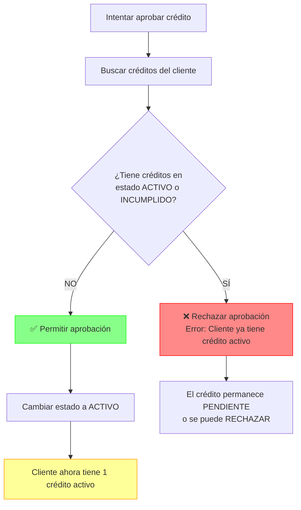
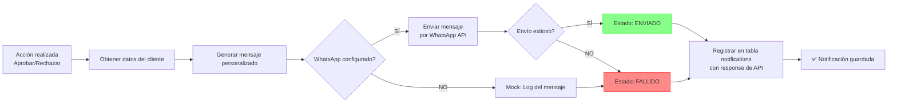
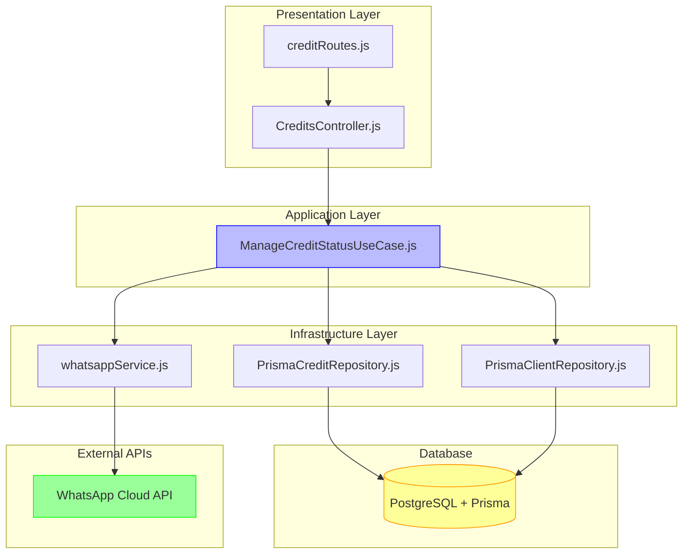
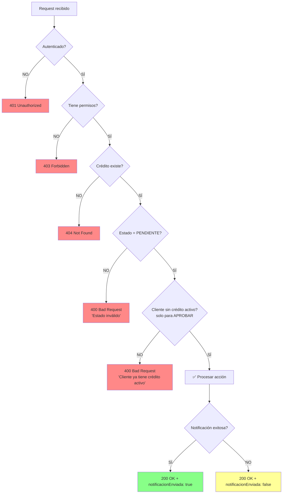

# 📊 Diagramas de Flujo - Aprobación y Rechazo de Créditos

## Flujo General del Sistema



---

## Flujo de Aprobación Detallado



---

## Flujo de Rechazo Detallado



---

## Estados del Crédito



---

## Validación de Crédito Único por Cliente



---

## Proceso de Notificaciones



---

## Arquitectura de Capas



---

## Manejo de Errores



---

## Ejemplo de Datos - Antes y Después

### ANTES de Aprobar
```json
{
  "id": 1,
  "numeroCredito": "CRE-2025-000001",
  "clienteId": 1,
  "estado": "PENDIENTE",
  "montoPrincipal": 5000,
  "cuotas": 12,
  "created_by": 1,
  "updated_by": null,
  "created_at": "2025-11-03T10:00:00Z",
  "updated_at": "2025-11-03T10:00:00Z"
}
```

### DESPUÉS de Aprobar
```json
{
  "id": 1,
  "numeroCredito": "CRE-2025-000001",
  "clienteId": 1,
  "estado": "ACTIVO", // ← Cambió
  "montoPrincipal": 5000,
  "cuotas": 12,
  "created_by": 1,
  "updated_by": 2, // ← Usuario que aprobó
  "created_at": "2025-11-03T10:00:00Z",
  "updated_at": "2025-11-03T15:30:00Z" // ← Timestamp actualizado
}
```

### Nueva Notificación Creada
```json
{
  "id": 1,
  "clienteId": 1,
  "tipo": "CREDITO_APROBADO",
  "mensaje": "¡CRÉDITO APROBADO! ✅\n\nEstimado/a Juan Pérez...",
  "medio": "WHATSAPP",
  "estadoEnvio": "ENVIADO",
  "responseApi": "{\"success\": true, \"messageId\": \"wamid.xyz...\"}",
  "fechaEnvio": "2025-11-03T15:30:05Z",
  "created_at": "2025-11-03T15:30:05Z"
}
```

---

## Endpoints Resumidos

| Método | Endpoint | Acción | Estado Requerido | Permiso |
|--------|----------|--------|------------------|---------|
| POST | `/credits/:id/approve` | Aprobar | PENDIENTE | `credits.approve` |
| POST | `/credits/:id/reject` | Rechazar | PENDIENTE | `credits.reject` |
| GET | `/credits` | Listar | - | `credits.read` |
| GET | `/credits/:id` | Ver detalle | - | `credits.read` |
| POST | `/credits` | Crear | - | `credits.create` |

---

**Estos diagramas muestran visualmente cómo funciona toda la implementación.** 📊
